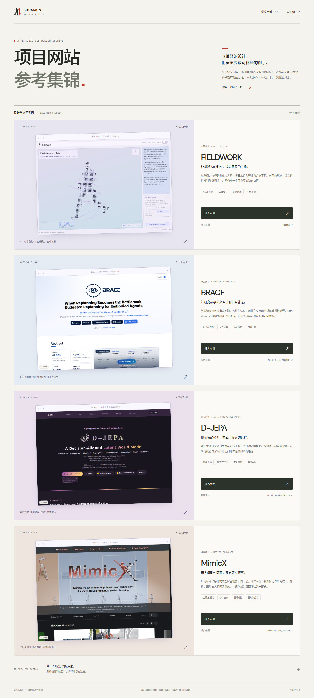

# 项目网站参考集锦

为自己的项目网站建立一个可持续扩展的设计参考库。首页提供实际预览、特点说明、参考来源和独立示例入口；每个例子保留自己的视觉与交互，并可返回集锦。

**集锦首页：** https://shuaijun-liu.github.io/pages/

## 已收录的例子

| 示例 | 在线体验 | 参考与特点 |
| --- | --- | --- |
| 001 · FIELDWORK | [进入动画示例](https://shuaijun-liu.github.io/pages/examples/fieldwork/) | 参考 xdof.ai 的动效表现，包含人形采摘、双夹爪持杯、折衣、奔跑四场景，以及方块字符、关节拖尾、视角交互、渐隐轮播和明暗主题 |
| 002 · BRACE | [进入项目示例](https://shuaijun-liu.github.io/pages/examples/brace/) | 论文项目页、蓝色视觉、独立交互动画与多平台展示 |
| 003 · D-JEPA | [进入项目示例](https://shuaijun-liu.github.io/pages/examples/d-jepa/) | 紫色主题、交互式模型讲解、步骤演示与实验视频 |
| 004 · MimicX | [进入项目示例](https://shuaijun-liu.github.io/pages/examples/mimicx/) | 全屏动作主视觉、画廊、图片浏览器与同步视频对比 |



[动画桌面预览](docs/preview-desktop.png) · [双臂持杯](docs/preview-transfer.png) · [折衣](docs/preview-fold.png) · [奔跑](docs/preview-run.png) · [深色模式](docs/preview-dark.png)

## 本地运行与验证

推荐 Node.js 22。

```sh
npm ci
npm run dev
```

```sh
npm run build
npm run preview
```

浏览器测试：

```sh
npx playwright install chromium
npm test
```

测试覆盖首页与示例往返导航、嵌套地址直接访问与刷新、模型和许可加载、移动端布局，以及原有四场景、轮播、暂停、视角、主题、弹窗、低动态偏好和备用渲染。测试浏览器采用软件渲染。

## 已有项目网站的收录

BRACE、D-JEPA、MimicX 使用对应代码仓库 `docs/` 网站的静态快照，放在 `public/examples/`。保留原设计、脚本、图片、视频、讲解子页面和许可；仅为 HTML 增加返回集锦导航。原项目工作区不会被修改，训练代码、检查点和数据集未收录。D-JEPA 的本地稿件 PDF 不包含在快照中，论文按钮继续链接原站指定的 arXiv。

每个快照的 `snapshot.json` 保存来源仓库、提交、文件校验和与本地变更标记。导入时 D-JEPA 的 `docs/` 存在本地改动，因此以实际文件哈希为准。

更新快照时运行：

```sh
python3 scripts/import-project-sites.py /path/to/BRACE-code /path/to/D-JEPA-code-repo /path/to/MimicX-code-repo
npm run build
npm test
```

导入工具只替换这三个已登记的快照目录；预览截图与目录卡片在网站检查后另行更新。

## 新增一个例子

1. 新建 `examples/<slug>/index.html`，为该例子添加独立的脚本与样式入口。
2. 在 `src/collection.js` 的 `examples` 数组中添加名称、描述、标签、预览图、参考来源与 `./examples/<slug>/` 地址。预览图通过 ES module 导入，让构建自动处理资源路径。
3. 示例页面添加 `href="../../"` 的“返回集锦”入口。示例的自托管公共资源应相对站点根目录解析，避免误指向当前子目录。
4. 构建会自动发现 `examples/` 下一层目录中的 `index.html`，无需手动新增 Vite 入口。补充示例测试后推送部署。

首页计数由示例数组自动更新。目前只展示实际完成的例子。首页加载静态预览，进入 FIELDWORK 后才加载 Three.js 与人形模型。

## 文件结构

```text
index.html                    集锦首页、介绍与目录容器
src/collection.js             示例登记、预览与入口
src/collection.css            集锦首页样式
examples/fieldwork/index.html 第一个独立示例
src/main.js                   FIELDWORK 文案、主题、曲线与弹窗
src/scenes.js                 四种主体、关节动作、道具与模型加载
src/motion.js                 字符渲染、轨迹、轮播与视角控制
src/style.css                 FIELDWORK 样式
public/examples/              三个已有项目网站的静态快照
public/collection-navigation.css  导入页面的返回集锦导航
public/models/                优化人形模型及来源记录
public/licenses/              字体与模型许可证
scripts/                      模型转换和项目网站导入工具
tests/                        集锦导航及示例行为测试
.github/workflows/deploy.yml   GitHub Pages 构建、测试与部署
```

## 部署

GitHub Pages 的 Source 使用 **GitHub Actions**。推送 `main` 后自动构建、测试并发布。采用静态多页结构，每个示例都能直接访问和刷新，支持 `/pages/` 子路径，不依赖客户端路由回退。

## 主体动画的后续复用

机器人／机械臂的 ASCII、粒子和运动拖尾已列为后续自有项目网站的主要功能之一。现有三维路线可复用；用户视频 → 主体分离 → 字符动画路线尚待素材与开发。

构建方法见 [动效实现](docs/motion-design.md) 与 [复用说明](project/notes.md)，计划见 [阶段计划](project/task_plan.md)。

## 来源与许可

FIELDWORK 的交互表现参考 [xdof.ai](https://www.xdof.ai/)，代码独立实现，品牌与文案替换。人形采用 BSD-3-Clause 授权的 Unitree G1，双臂道具和动作自行构建；本仓库不包含参考站的脚本或模型，不代表与该公司有关联。BRACE、D-JEPA、MimicX 的原有作者、资源链接和许可证随各自快照保留。详细来源见 [THIRD_PARTY.md](THIRD_PARTY.md)。
