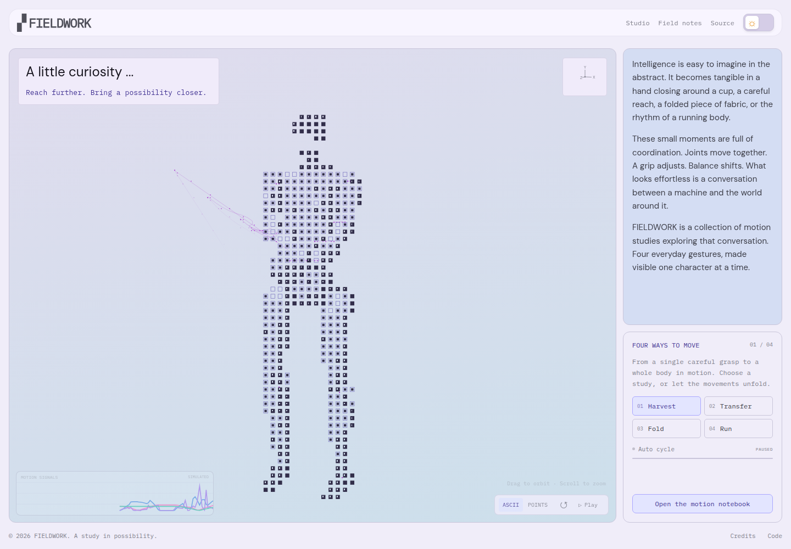

# FIELDWORK — A study in motion

一个实时三维字符动画网站，包含人形采摘、双夹爪持杯、人形折衣和全身奔跑四个场景。页面构图、淡紫蓝色调、方块字符与切换节奏接近参考站；FIELDWORK 品牌与文案独立编写。人形几何采用 BSD 授权的 Unitree G1，其余道具与动作自行构建。

**网站地址：** https://shuaijun-liu.github.io/pages/



[双臂持杯](docs/preview-transfer.png) · [折衣](docs/preview-fold.png) · [奔跑](docs/preview-run.png) · [深色模式](docs/preview-dark.png) · [手机布局](docs/preview-mobile.png)

## 本地运行

推荐 Node.js 22。

```sh
npm ci
npm run dev
```

生产构建和预览：

```sh
npm run build
npm run preview
```

## 交互

- 拖动主场景旋转视角；桌面滚轮缩放。
- 聚焦场景后，方向键旋转，`+` / `-` 缩放。
- ASCII / POINTS 切换字符和粒子表现。
- Pause / Play 暂停或恢复；回转按钮重置视角。
- 四个场景手动切换或约每 8 秒自动轮播，支持字符消散／聚合过渡；四条模拟运动曲线与多关节拖尾同步更新。
- 顶栏切换明暗主题；Field notes 与 Studio 打开说明。
- 手机采用纵向布局，保留正常滚动；系统设置“减少动态效果”时默认静止，允许主动播放。
- 无 WebGL 时使用 Canvas 2D 机械运动备用视图。

## 后续项目网站的核心功能

已确认将**机器人／机械臂主体的 ASCII、粒子和运动拖尾动画**作为后续自有项目网站的主要功能之一。下一阶段优先支持用户视频：提取主体、保留真实动作、转换视觉表现，并接入首页主场景。

当前三维演示已实现；视频转换流程尚待开发。构建方法、输入要求、两条实现路线与验收标准见 [主体动画复用说明](project/notes.md)，确认记录见 [项目决策](project/decision_log.md)，实施顺序见 [阶段计划](project/task_plan.md)。

## 文件结构

```text
src/main.js       文案交互、主题、曲线与弹窗
src/motion.js     字符渲染、多关节拖尾、轮播过渡和视角控制
src/scenes.js     四种主体、动作、道具与模型加载
src/style.css     页面布局、配色、入场过渡和响应式样式
index.html        页面内容与无障碍语义
public/           favicon、优化人形模型、模型来源与许可证
scripts/          模型转换与简化工具
tests/           浏览器行为测试
.github/workflows/deploy.yml  GitHub Pages 自动构建、测试与部署
```

## 调整动画

- `src/scenes.js`：场景参数、主体几何、关节姿态、采摘逆运动学与布面折叠。
- `src/motion.js`：字符／粒子映射、轨迹、相机、消散过渡与自动轮播。
- `src/main.js`：主题、打字效果、运动信号与弹窗。
- `src/style.css`：构图、配色与响应式布局。

人形模型可用 `scripts/build-robot-asset.mjs` 从 MuJoCo Menagerie 的 G1 源文件重建，来源、许可、输入校验和与简化参数均随仓库保存。正常运行直接使用已优化模型。

## 验证

```sh
npx playwright install chromium
npm run build
npm test
```

测试包含实时动画、暂停恢复、场景切换、轨道视角重置、主题持久化、弹窗键盘操作、手机/平板布局、减少动态效果和无 WebGL 的备用渲染。测试浏览器使用软件渲染。

## GitHub Pages

在仓库 **Settings → Pages → Build and deployment → Source** 选择 **GitHub Actions**。随后对 `main` 的推送会先构建和测试，通过后自动发布。也可以在 Actions 页面手动运行 **Build, test, and deploy Pages**。

构建采用相对资源路径，可部署到 `/pages/` 或其他子目录。字体随构建打包；运行时不需要字体 CDN、远程模型、API 密钥或后端。

## 创作与依赖

交互表现研究参考 [xdof.ai](https://www.xdof.ai/)，代码独立实现。本仓库不包含其源代码、文案、Logo、照片、视频、模型或字体文件；不是该公司的官方网站，也不表示关联。FIELDWORK 是此演示项目的虚构名称，不声称实际团队、融资或研究成果。

人形模型、第三方库和字体保留各自许可，详见 [THIRD_PARTY.md](THIRD_PARTY.md)。技术拆解见 [docs/motion-design.md](docs/motion-design.md)。
